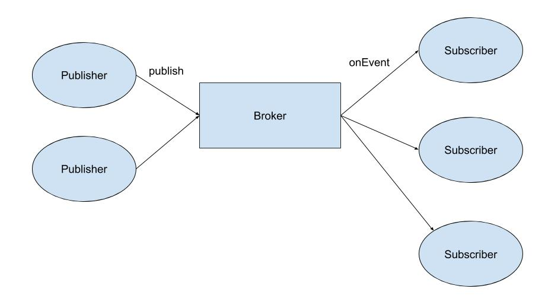
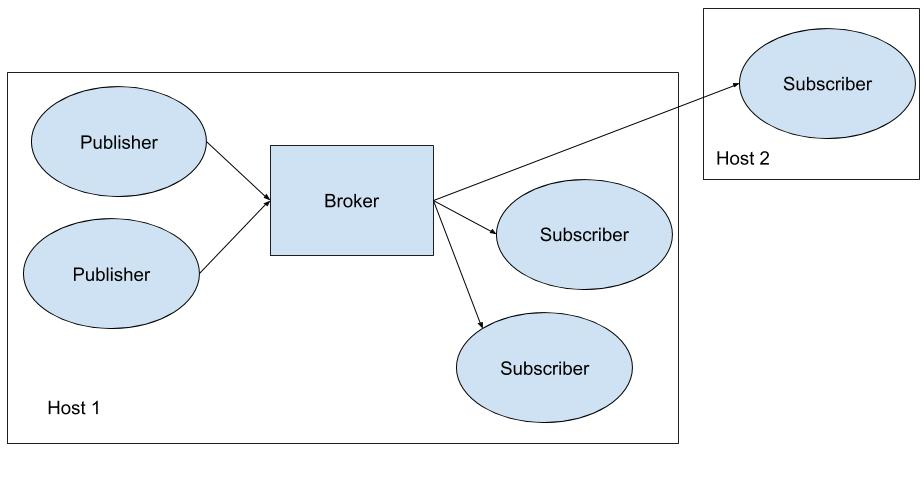
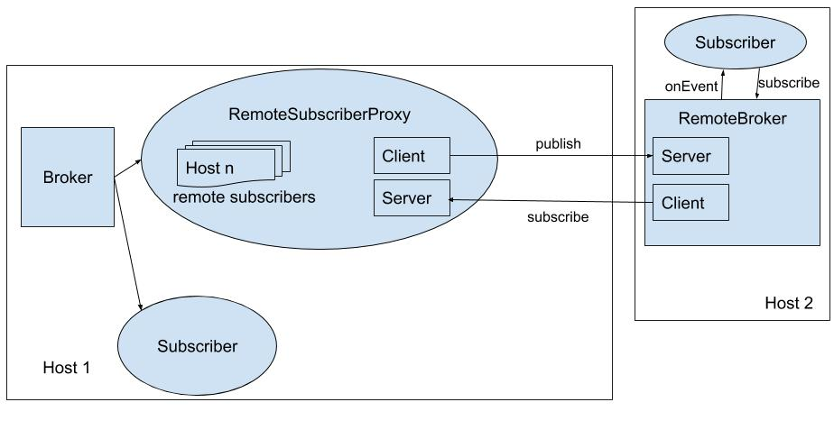

Project 2 - Publish/Subscribe Framework
=======================================

### <del>Due - Monday, October 8, 2018 - 11am</del>
### Due - Wednesday, October 17, 2018 - 11am

For this project, you will implement a message broker framework that will support [publish/subscribe](https://en.wikipedia.org/wiki/Publish%E2%80%93subscribe_pattern) functionality. You will practice using the following:

- Concurrency and threads
- Sockets
- Java Generics
- Good design practices

Note, this program does not require a significant amount of code, however you will be heavily graded on your design. You are also expected to spend a significant portion of time comparing the performance of the `Broker` implementations.

This assignment has two parts:

- Part 1 (95%) - Part 1 requires that you implement a program that will be run as a single Java process on one host. You will earn a maximum of 95% credit for completing the part 1 requirements. You *may* take advantage of [Project Resubmission as discussed on the Syllabus](https://cs601-f18.github.io/syllabus.html) if you meet all of the part 1 functionality requirements *even if you do not complete the part 2 functionality requirements*.
- Part 2 (5%) - Part 2 requires that you implement a program that will allow a `Subscriber` to be executed on a remote host. This will require implementing client/server functionality as part of your solution.

## Requirements (Part 1)

You will implement a framework with the following architecture:



Any number of publishers may publish data by calling the method `publish` on the `Broker`. Any number of subscribers may `subscribe`, and the `Broker` will deliver each message to all subscribers via the `onEvent` method.

### `Broker`

You will implement the following interface for the `Broker`.

```java
public interface Broker<T> {

	/**
	 * Called by a publisher to publish a new item. The 
	 * item will be delivered to all current subscribers.
	 * 
	 * @param item
	 */
	public void publish(T item);
	
	/**
	 * Called once by each subscriber. Subscriber will be 
	 * registered and receive notification of all future
	 * published items.
	 * 
	 * @param subscriber
	 */
	public void subscribe(Subscriber<T> subscriber);
	
	/**
	 * Indicates this broker should stop accepting new
	 * items to be published and shut down all threads.
	 * The method will block until all items that have been
	 * published have been delivered to all subscribers.
	 */
	public void shutdown();
}
```

You will implement the following *three* concrete `Broker` implementations.


#### `SynchronousOrderedDispatchBroker`

The `SynchronousOrderedDispatchBroker` has the following properties:

- **Synchronous** - A newly published item will be *synchronously* delivered to all subscribers. The `publish` method will not return to the publisher until all subscribers have completed the `onEvent` method.
- **Ordered** - The `Broker` guarantees that items from different publishers *may not interleave*. If a publisher is delivering to subscribers the next publisher must block until the first has finished.

<hr/>

#### `AsyncOrderedDispatchBroker`

The `AsyncOrderedDispatchBroker` has the following properties:

- **Asynchronous** - A newly published item will be *asynchronously* delivered to all subscribers. The `publish` method will return to the publisher immediately, and the item will be delivered to the subscribers after the `publish` method completes.
- **Ordered** - The `Broker` guarantees that items from different publishers will be delivered to each subscriber *in the same order*. If any subscriber receives item1 before item 2 then all subscribers will receive item1 before item2.

**Hints**

- Consider using a `BlockingQueue` to queue new items as they are published. 
- You may **not** use a `BlockingQueue` implementation from `java.util`, however you may extend and use the implementation presented in class. Consider adding a `poll` method.
- Consider using one additional thread to deliver messages to subscribers in order.

<hr/>

#### `AsyncUnorderedDispatchBroker`

The `AsyncUnorderedDispatchBroker ` has the following properties:

- **Asynchronous** - A newly published item will be *asynchronously* delivered to all subscribers. The `publish` method will return to the publisher immediately, and the item will be delivered to the subscribers after the `publish` method completes.
- **Unordered** - The `Broker` makes no guarantees about the order in which items are delivered to the subscribers. 

**Hints**

- Consider using an instance of `ExecutorService` to asynchronously `execute` jobs to deliver items to subscribers. 

<hr/>

### `Subscriber`

The `Subscriber` interface must be implemented as follows:

```java
public interface Subscriber<T> {

	/**
	 * Called by the Broker when a new item
	 * has been published.
	 * @param item
	 */
	public void onEvent(T item);
	
}
```

### Test Application

The framework described above will be implemented such that it could support a variety of applications. A `Broker` could handle any type of item, which is why we have used Generics.

For your interactive grading demonstration, you will implement an application that will re-sort the Amazon reviews data set. Currently, the data is sorted by type of product (i.e., cell phones, home and kitchen, etc). Your demonstration application will use the publish/subscribe framework to create two new .json files---one with old reviews and one with new reviews.

#### Publishers

1. You will implement at least *two* publishers. 
2. Each publisher must run in a separate thread.
3. Each publisher will be responsible for *one* of the 5-core reviews files from the [Amazon product data](http://jmcauley.ucsd.edu/data/amazon/) dataset. You may choose which files to use for your demonstration, however I recommend Home and Kitchen and Apps for Android.
4. The publisher will parse each review as a separate JSON object and publish the object as a single item.

#### Subscribers

1. You will implement at least *two* subscribers.
2. All subscribers will receive all items. One subscriber will filter items and save to a file only the older reviews and the other will filter items and save to a file only the newer reviews.
3. I recommend using a unix review time of 1362268800 to separate old and new. This should yield roughly 774,000 new reviews and 529,000 old reviews using the data sets recommended above.

#### Brokers

1. You will use this test application to *compare the performance* of the three `Broker` implementations. 
2. During interactive grading you will execute your program using all three implementations and you will need to be prepared to answer questions about why certain `Broker` implementations are faster than others.


### Additional Requirements

1. For all `Broker` implementations, the list of subscribers must be thread safe.
2. Your solution must *accurately* measure the time required to complete delivery of all items to all subscribers. To achieve this you will need to ensure that your `shutdown` method works correctly---waiting until all items have been processed before returning.

### Program Execution

You may decide how your program will be executed, however your design grade will include the following:

1. Naming of your main class.
2. Approach for specifying the input files.
3. Approach for specifying the output files.

Solutions that hard code file paths will receive a deduction.

### External Libraries

The only external libraries you may use for this assignment are [GSON](https://github.com/google/gson) 2.8.5 and JUnit. It is not required that you use JUnit for unit testing (but you should make sure you test your code). For this assignment, it is your responsibility to set up the `pom.xml` file correctly.


## Requirements (Part 2)

**You should only proceed to part 2 once you have completed part 1. It is strongly advised that you complete interactive grading for part 1 before you begin part 2.**

To earn the final 5% on this assignment you will extend your part 1 implementation to allow a subscriber to execute on a separate host. Conceptually, this looks like the following:



### Hints

1. Host 1 will need to implement a server that allows a remote subscriber to send a registration message.
2. When a remote subscriber is executed, it will connect to the registration server.
3. When a new item is published it will be forwarded from Host 1 to Host 2, then delivered to the subscriber.
4. There are lots of ways to design a solution, however it is recommended that you modify the part 1 solution as little as possible. I have done this by implementing a `RemoteSubscriberProxy` that behaves like a normal `Subscriber` to the `Broker` on Host 1 but implements a server to accept connections from Host 2 and a client to forward items to Host 2. On Host 2, I implement a `RemoteBroker` that behaves like a normal `Broker` to the `Subscriber` on Host 2 but proxies messages coming from the `RemoteSubscriberProxy`. The figure below shows this implementation, omitting detail of the original publishers.
 	



## Submission

1. Use the following link to create your private github repository for this assignment: [Project 2](https://classroom.github.com/a/iL0YiNu2). **Note**, the repository is completely empty so you will need to set it up as required by the assignment.
2. For full credit, make sure to follow all [Style Guidelines](https://github.com/CS601-F18/notes/blob/master/admin/style.md). Points will be deducted for each violation.
3. All code and the jar file described above must be submitted to your github repository by <del>**Monday, October 8, 2018 - 11am**</del> **Wednesday, October 17, 2018 - 11am.**
4. There are no unit test cases provided for this project, but during interactive grading you will be expected to demonstrate your solution running on at least two of the Amazon review datasets.

## Extra Credit
You may earn up to one (1) point of extra credit by completing interactive grading and submitting all required code during the professor's office hours on or before Friday, October 5, 2018. Note that office hours are first come, first served and students with assignment questions have priority over students wishing to complete early interactive grading. To earn the extra credit it is suggested you come for interactive grading well before the deadline!

Students who submit early and earn 100% may be eligible for an additional extra credit assignment given at the time of submission. Note that additional extra credit will only be awarded *after* a student has earned 100% on his/her solution.

## Grading Rubric

| Points | Criterion |
| ------ | -------- |  
| 15 | **Functionality - Part 1** -  `SynchronousOrderedDispatchBroker` |  
| 20 | **Functionality - Part 1** -  `AsyncUnorderedDispatchBroker` |  
| 20 | **Functionality - Part 1** -  `AsyncOrderedDispatchBroker` |  
| 5 | **Functionality - Part 1** -  Able to explain differences in running time for three `Broker`  implementations. |  
| 5 | **Design - Part 1** - Design requirements implemented as specified. |  
| 5 | **Design - Part 1** - `shutdown` correctly implemented. |  
| 5 | **Design - Part 1** - Thread safety implemented correctly. |  
| 10 | **Design - Part 1** - Test Application design. |  
| 10 | **Design - Part 1** - Meets all style guidelines. |  
| 3 | **Functionality - Part 2** -  Demonstrates `Subscriber` and `Broker` running on separate hosts. |  
| 2 | **Design - Part 2** -  Solution is well designed and part 1 components are minimally modified. |  


Partial credit may be awarded for partial functionality and/or partially correct design or style elements.

## Academic Dishonesty

Any work you submit is expected to be your own original work. If you use any web resources in developing your code you are strongly advised to cite those resources. The only exception to this rule is code that is posted on the class website. The URL of the resource you used in a comment in your code is fine. If I google even a single line of uncited code and find it on the internet you may get a 0 on the assignment or an F in the class. You may also get a 0 on the assignment or an F in the class if your solution is at all similar to that of any other student.

